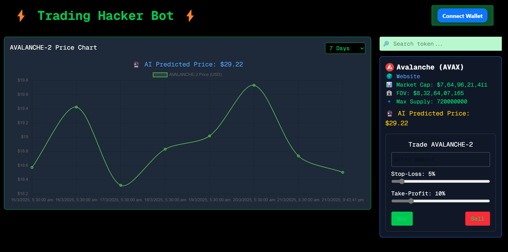
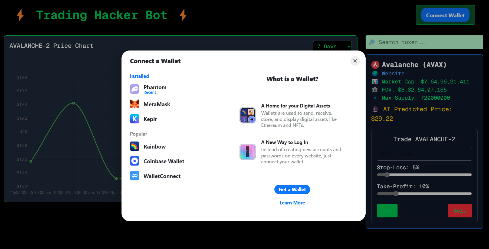
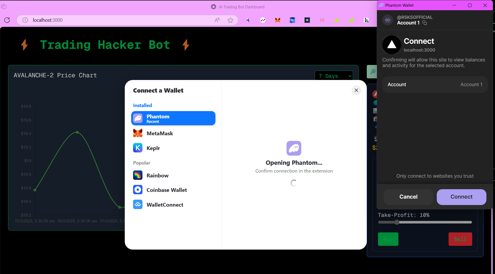
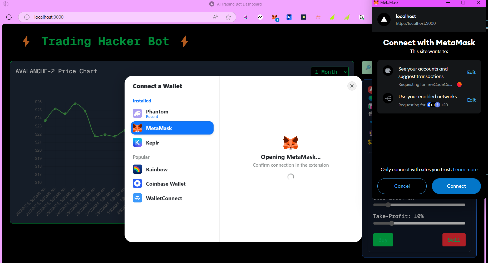
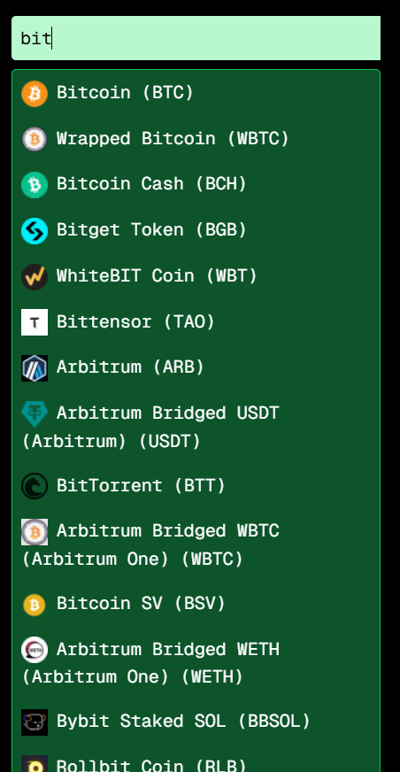
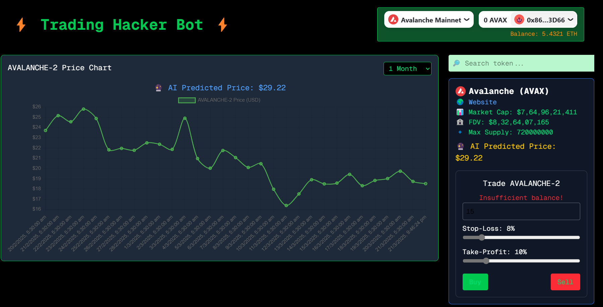
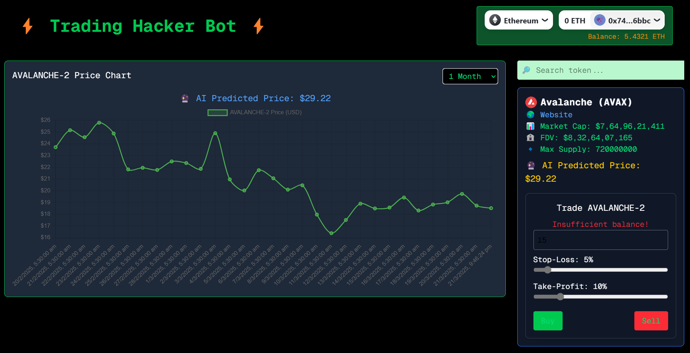

### README.md  

# ⚡ Trading Hacker Bot  

## 📌 Introduction  
**Trading Hacker Bot** is a powerful decentralized trading interface that enables users to seamlessly interact with cryptocurrencies and DeFi markets. This bot provides real-time market data, AI-driven price predictions, and efficient token trading functionalities.  

## 🚀 Features  
- **🔗 Web3 Wallet Integration**: Uses [RainbowKit](https://www.rainbowkit.com/) and [Wagmi](https://wagmi.sh/) to connect Web3 wallets.  
- **📈 Live Market Data**: Fetches token data from **CoinGecko** and a custom backend API.  
- **🤖 AI-Driven Predictions**: Uses an AI model to provide **future price predictions**.  
- **🛠️ Trading Interface**: Allows **buying & selling** tokens with real-time validation.  
- **📡 Multi-Chain Support**: Supports **Ethereum, Avalanche, Sepolia, and Fuji Testnet**.  
- **🕵️ Secure & Fast**: Optimized API calls with **debounced search functionality**.  

---

## 🏗️ Tech Stack  

| Technology | Purpose |
|------------|---------|
| **Next.js (React)** | Frontend framework for UI |
| **TypeScript (Optional)** | Ensures type safety |
| **Wagmi + RainbowKit** | Wallet connection (MetaMask, WalletConnect, etc.) |
| **Axios** | Fetching external API data |
| **Tailwind CSS** | Styling the UI |
| **CoinGecko API** | Fetching real-time market data |
| **Custom Backend (FastAPI/Django)** | AI prediction and additional token info |

---

## 🎯 Problem It Solves  
### ❌ Traditional Trading Interfaces Issues  
- **Slower Market Data**: Centralized exchanges often delay token price updates.  
- **Complex UI**: Many DeFi platforms are difficult to navigate.  
- **Lack of Predictions**: Users trade without reliable future price estimates.  

### ✅ How This Bot Solves It  
- **Instant Data Fetching**: Uses CoinGecko for **real-time token info**.  
- **Simplified UI**: Clean interface with **intuitive search & trade functions**.  
- **AI-Powered Price Predictions**: Helps traders make informed decisions.  

---

## ⚙️ Supported Blockchains  

| Blockchain | Chain ID |
|------------|---------|
| Ethereum | `1` |
| Avalanche | `43114` |
| Avalanche Fuji | `43113` |
| Sepolia | `11155111` |

---

## 📡 API Endpoints  

### 1️⃣ Fetch Token Information  
📌 Fetches live market data for a given token.  
**Endpoint:**  
```
GET /api/token-info/{tokenId}
```
**Response Example:**  
```json
{
  "name": "Ethereum",
  "symbol": "ETH",
  "image": "https://assets.coingecko.com/coins/images/279/large/ethereum.png",
  "market_cap": 300000000000,
  "fdv": 320000000000,
  "max_supply": "Infinite"
}
```

### 2️⃣ Fetch AI Predicted Price  
📌 Returns the AI model’s predicted future price of a token.  
**Endpoint:**  
```
GET /api/ai-predict/{tokenId}
```
**Response Example:**  
```json
{
  "predicted_price": "4100.25"
}
```


## 🛠️ Setup & Installation  

### 1️⃣ Clone the Repository  
```bash
git clone https://github.com/RSKKSOFFICIAL/Trading_bot.git
cd Trading_bot
```

### 2️⃣ Install Dependencies  
```bash
npm install
```

### 3️⃣ Run the Development Server  
```bash
npm run dev
```
🚀 The app will be available at **http://localhost:3000**

---

## 🚀 Future Enhancements  
- ✅ **Multi-DEX Trading Integration** (Uniswap, PancakeSwap, etc.)  
- ✅ **More AI Features** (Sentiment analysis, trade signals)  
- ✅ **Advanced Analytics** (Trading volume, historical data)  

---

## 🤝 Contributing  
1. Fork the repository  
2. Create a new branch: `git checkout -b feature-name`  
3. Commit your changes: `git commit -m "Added new feature"`  
4. Push to branch: `git push origin feature-name`  
5. Open a Pull Request 🚀  

---

## 💡 Credits  
Built with ❤️ using **Next.js, Wagmi, RainbowKit, CoinGecko API, and FastAPI**.  

---

## ⭐ Support the Project  
If you find this project useful, **give it a star** ⭐ on GitHub!  

---

🔥 **Trading Hacker Bot - Trade Smarter, Faster & Better! SnapShots During Development** 🔥

Here are some snapshots of the project:  

  
  
  
  
  
  
 